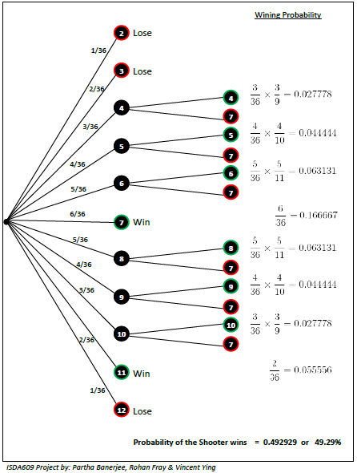

\pagebreak

```{r clear, include=FALSE, echo=FALSE}
# Added this "clear all" section to make sure we can run use "Chunks/Run All"" without conflict.
# Still does not catch package info, but that will be seen when knit.

# Start with a Clean memory
rm(list=ls())

# Supress warnings particularly during loading of libraries
options(warn=-1)
```

```{r config, echo=FALSE, results='hide'}
# Library and Directory Config

# Add all required packages here. 
required.packages <- c("xtable","ggplot2")

# Check to see if packages in required.packages are installed
have.pkgs <- required.packages %in% installed.packages()

if(length(required.packages) > sum(have.pkgs)){
  install.packages(required.packages[!have.pkgs])
}

for(pkg in required.packages){
  library(pkg, character.only = TRUE, quietly=TRUE, warn.conflicts=FALSE)
}

# Make sure we're in the right working directory:  "Code"
if("Code" %in% list.files()){
  setwd("Code")
}

if(!("Code" %in% list.files("..")))
{
  stop
}

# Disable scientific notation
options(xtable.comment = FALSE)
```


## Problem Definition


### Project 5.3.3 (page 201): Craps Monte Carlo Simulation


Craps - Construct and perform a Monte Carlo simulation of the popular casino game of craps. The rules are as follows:      
      
There are two basic bets in craps, pass and don't pass. In the pass bet, you wager that the shooter (the person throwing the dice) will win; in the don't pass bet, you wager that the shooter will lose. We will play by the rule that on an initial roll of 12 ("boxcars"), both pass and don't pass bets are losers. Both are even-money bets.      
      
Conduct of the game:  

  - Roll a 7 or 11 on the first roll: Shooter wins (pass bets win and don't pass bets lose).  
  - Roll a 12 on the first roll: Shooter loses (boxcars; pass and don't pass bets lose).  
  - Roll a 2 or 3 on the first roll: Shooter loses (pass bets lose, don't pass bets win).   
  - Roll 4, 5, 6, 8, 9, 10 on the first roll: This becomes the point. The object then becomes to roll the point again before rolling a 7.     
  - The shooter continues to roll the dice until the point or a 7 appears. Pass bettors win if the shooter rolls the point again before rolling a 7. Don't pass bettors win if the shooter rolls a 7 before rolling the point again.  

      
      
Write an algorithm and code it in the computer language of your choice. Run the simulation to estimate the probability of winning a pass bet and the probability of winning a don't pass bet. Which is the better bet? As the number of trials increases, to what do the probabilities converge?

\pagebreak

## Solution - Mathematical Approach
      
Craps involves the rolling of two dice. The assumption is that the dice are fair and the outcomes of the various rolls are independent.    

### Simple Mathematics
      
The possible totals obtained from rolling two dice are as below:

&nbsp;|&nbsp;|1 |	2 |	3 |	4 |	5 |	6
--|--|----|---|---|---|---|---
1	|&nbsp;|2 |	3 |	4 |	5 |	6 |	7 
2	|&nbsp;|3 |	4 |	5 |	6 |	7 |	8 
3	|&nbsp;|4 |	5 |	6 |	7 |	8 |	9 
4	|&nbsp;|5 |	6 |	7 |	8 |	9 |	10 
5	|&nbsp;|6 |	7 |	8 |	9 |	10|	11 
6	|&nbsp;|7 |	8 |	9 |	10|	11|	12 

<P>
      
Now let us examine the rules:   

- Roll a 7 or 11 on the first roll ("natural"): Shooter wins    
     Now the probability of getting 7 or 11 is $\frac{8}{36}$, or about `r round(800/36,2)`&#37;.    

- Roll a 2 or 3 or 12 on the first roll ("craps"): Shooter loses    
     The probability of getting 2 or 3 or 12 is $\frac{4}{36}$, or about `r round(400/36,2)`&#37;.

- Roll 4, 5, 6, 8, 9, 10 on the first roll: This becomes the point. The Shooter's goal then becomes to roll the point again before rolling a 7        
     The probability of rolling 4 is $\frac{3}{36}$. Once Shooter has rolled the 4, the only cells that matter are the cells containing 4 and 7. All other cells can be ignored. There are 9 cells containing 4 or 7 of which only 3 cells are favorable to Shooter. Hence the probability of Shooter rolling another 4 before a 7 is $\frac{3}{9}$. Therefore, the probability of rolling a 4, and then rolling a 4 before a 7 is $\frac{3}{36} \times \frac{3}{9}$ or about `r round(3/36*3/9*100,2)`&#37;.      
     Table below summarizes the winning probabilities of Shooter in craps:

Initial Roll  | Probability of Winning |	Probability in Decimal
------ | ------------ | ---------- 
4 |	$\frac{3}{36} \times \frac{3}{9}$	 | `r 3/36*3/9`
5	| $\frac{4}{36} \times \frac{4}{10}$ | `r 4/36*4/10`
6	| $\frac{5}{36} \times \frac{5}{11}$ | `r 5/36*5/11`
7	| $\frac{6}{36}$ |	`r 6/36`
8	| $\frac{5}{36} \times \frac{5}{11}$ | `r 5/36*5/11`
9	| $\frac{4}{36} \times \frac{4}{10}$ | `r 4/36*4/10`
10|	$\frac{3}{36} \times \frac{3}{9}$	 | `r 3/36*3/9`
11|	$\frac{2}{36}$ |	`r 2/36`
&nbsp;| **Total** |	**`r 3/36*3/9*2 + 4/36*4/10*2 + 5/36*5/11*2 + 6/36 + 2/36`**

<P>
      
### More Mathematical
      
Let $P(p = n)$ is the probability of rolling a total $n$. For rolls that are not naturals (7 or 11, say W) or craps (2 or 3 or 12, say L), the probability that the point $p = n$ will be rolled before 7 is found from
      
$P(win \mid p = n) = \frac{P(p = n)}{P(p = 7)+P(p = n))} = \frac{P(p = n)}{\frac{1}{6}+P(p = n)}$
      
      
Applying the above, we get the same result as above:      
      
Initial Roll ($n$) | $P(p = n)$ | $P(win \mid p = n)$ | $P(win) = P(p = n) P(win \mid p = n)$ | Probability in Decimal
---------------- | ---------- | ------------------ | ------------------------------------ | ---------------------
2 | $\frac{1}{36}$	| 0	| 0	| 0
3 | $\frac{2}{36}$	| 0	| 0	| 0
4	| $\frac{3}{36}$	| $\frac{3}{9}$	| $\frac{3}{36} \times \frac{3}{9}$	| `r 3/36*3/9` 
5	| $\frac{4}{36}$	| $\frac{4}{10}$|	$\frac{4}{36} \times \frac{4}{10}$|	`r 4/36*4/10` 
6	| $\frac{5}{36}$	| $\frac{5}{11}$|	$\frac{5}{36} \times \frac{5}{11}$|	`r 5/36*5/11`
7	| $\frac{6}{36}$	| 1	| $\frac{6}{36}$	| `r 6/36` 
8	| $\frac{5}{36}$	| $\frac{5}{11}$|	$\frac{5}{36} \times \frac{5}{11}$|	`r 5/36*5/11` 
9	| $\frac{4}{36}$	| $\frac{4}{10}$|	$\frac{4}{36} \times \frac{4}{10}$|	`r 4/36*4/10` 
10|	$\frac{3}{36}$	| $\frac{3}{9}$|	$\frac{3}{36} \times \frac{3}{9}$ |	`r 3/36*3/9` 
11|	$\frac{2}{36}$	| 1	| $\frac{2}{36}$	| `r 2/36` 
12|	$\frac{1}{36}$	| 0	| 0	| 0

```{r calc1, echo=FALSE}
win <- 3/36*3/9*2 + 4/36*4/10*2 + 5/36*5/11*2 + 6/36 + 2/36
```
Hence, $P(win) = \sum_{n=2}^{12} P(p = n) P(win \mid p = n)$ = `r win` 


Hence the probability of the Shooter wins = `r round(win*100,2)`&#37;
      
Which implies the probability that the Shooter loses = `r round((1 - win)*100,2)`&#37;
      
**Note**: *We will see the same results in our decision tree model while solve this Craps game*.

### Back to Craps Problem
      
Here we have 2 types of bets - Pass and Don't Pass. In the Pass bet, the gambler wins only when Shooter wins and in Don't Pass bet the gambler wins only when Shooters loses except the Boxcars (Roll a 12 on the first roll).      
        
Hence, for the **_Pass bet gambler_**, the winning probability is:  `r round(win*100,2)`&#37;     
And for the Casino (or house), the winning probability is:  `r round((1 - win)*100,2)`&#37;      
Thus, _the house has an advantage of about 1.4% on any Pass bet_.
        
```{r calc2, echo=FALSE}
df <- data.frame(bins=c(runif(1,0,1)))
for (i in 1:(round(win,3)*1000)) {
  df <- rbind(df, data.frame(bins=c(1)))
}
for (i in 1:((1-round(win,3)-round(1/36,3))*1000-1)) {
  df <- rbind(df, data.frame(bins=c(runif(1,-2,-1))))
}
for (i in 1:(round(1/36,3)*1000)) {
  df <- rbind(df, data.frame(bins=c(runif(1,-1,0))))
}
# cat("Graphical representation of Shooter's Lose/Win:\n")
hist(df$bins, breaks=1.5, col=c("red","green"), main="", xlab="Casino (Red) / Pass bet Gambler (Green)", ylab="Frequency x 1000")
```
        
Now the probability of Boxcars = $\frac{1}{36}$ = `r round(100/36,2)`&#37;      
          
          
Hence, for **_Don't Pass bet gambler_**,
        
        
Event  | Probability
---------------  | ----------------------
TIE on Don't Pass bet	| $\frac{1}{36}$ = `r 1/36` = `r round(100/36,2)`&#37;
WIN on Don't Pass bet	| `r (1 - win)` - $\frac{1}{36}$ = `r (1-win-1/36)` = `r round((1-win-1/36)*100,2)`&#37;
LOSE on Don't Pass bet	| 1 - $\frac{1}{36}$ - `r (1-win-1/36)` = `r win` = `r round(win*100,2)`&#37;


Hence, mathematically we can say that for a particularly game, the winning probability of

* Pass bets: `r round(win*100,2)`&#37;
* Don't Pass bets: `r round((1-win-1/36)*100,2)`&#37;
* Boxcars (both Pass and Don't Pass bets lose): `r round(100/36,2)`&#37;        
        
        
```{r calc3, echo=FALSE}
# cat("Graphical representation of Pass / Don't Pass Win:\n")
boundaries <- seq(-2, 1, by=1);
colors = c("red", "yellow", "green")
hist(df$bins, breaks=boundaries, col=colors, main="", xlab="Don't Pass Win (Red) / All Lose (Yellow) / Pass Win (Green)", ylab="Frequency x 1000")
````
        
          
### Mathematical Conclusion
      
      
      
The casino has only a slight edge in craps. But, in the long run, the game is a money-maker for the casino since the casino plays on indefinitely. While in Pass bet scenario house is always in advantage, we need to analyze Don't Pass bet bit more.      

Since on the tie or Boxcars nobody wins, let us ignore that situation. If we reduce this to a win or lose situation, the probability that a Don't Pass Bet wins is $\frac{0.479293}{(0.479293 + 0.492929)}$ = 0.492987 and the probability that a Don't Pass Bet loses is 1 - 0.492987 = 0.507013. Thus the casino maintains a 1.4&#37; advantage over the player even in Don't Pass bet.
      
      
\pagebreak

## Simulation to verify Mathematical Approach
      
### Monte Carlo Simulation in R
      
      
```{r simu, echo=FALSE}
# Number of simulation
N = 10000
cat("Number of simulations = ", N, sep="")

# Define data frame
# First roll: dice1 = fx, dice2 = fy
# Last roll:  dice1 = lx, dice2 = ly
# n = number of rolls
# flag: -1 = Don't Pass, 1 = Pass, 0 = Boxcars
data = data.frame(fx=c(0), fy=c(0), lx=c(0), ly=c(0), n=c(0), flag=c(NA))

for (i in 1:N) {
  
  # n: number of times dice rolls
  n <- 1
  
  # First roll
  fx <- sample(1:6,1)
  fy <- sample(1:6,1)
  shooter <- fx + fy
  
  if (shooter == 12){
    data <- rbind(data, data.frame(fx=c(fx), fy=c(fy), lx=c(""), ly=c(""), n=c(n), flag=c(0)))
  } else if ((shooter == 7)||(shooter==11)){
    data <- rbind(data, data.frame(fx=c(fx), fy=c(fy), lx=c(""), ly=c(""), n=c(n), flag=c(1)))
  } else if ((shooter == 2)||(shooter==3)){
    data <- rbind(data, data.frame(fx=c(fx), fy=c(fy), lx=c(""), ly=c(""), n=c(n), flag=c(-1)))
  } else{
    point <- shooter

    repeat{
      n <- n + 1
      
      # n-th roll
      lx <- sample(1:6,1)
      ly <- sample(1:6,1)

      if (lx + ly == 7){
        data <- rbind(data, data.frame(fx=c(fx), fy=c(fy), lx=c(lx), ly=c(ly), n=c(n), flag=c(-1)))
        break
      }
      else if (lx + ly == point){
        data <- rbind(data, data.frame(fx=c(fx), fy=c(fy), lx=c(lx), ly=c(ly), n=c(n), flag=c(1)))
        break
      }
    }
  }
}

# Remove first row inserted at part of initialization
data <- data[!is.na(data$flag),]
```
        
        
**Data Definition**

* fx = Outcome of Dice-1 in first roll 
* fy = Outcome of Dice-2 in first roll 
* lx = Outcome of Dice-1 in last roll (if subsequent rolls are needed)
* ly = Outcome of Dice-2 in last roll (if subsequent rolls are needed)
* n = number of rolls
* flag:
    + 1 = Pass win
    + 0 = Boxcars (no one wins)
    + -1 = Don't Pass win
        
        
Top 25 simulated Craps data:

```{r simuresult1, echo=FALSE}
print(head(data, n=25), row.names=FALSE)
````
\pagebreak
Bottom 10 simulated Craps data:

```{r simuresult2, echo=FALSE}
print(tail(data, n=10), row.names=FALSE)
````

        
Pass wins:  `r nrow(data[data$flag==1,])` or `r round(nrow(data[data$flag==1,])*100/N,2)`&#37;        
Don't Pass wins:  `r nrow(data[data$flag==-1,])` or `r round(nrow(data[data$flag==-1,])*100/N,2)`&#37;       
No one wins:  `r nrow(data[data$flag==0,])` or `r round(nrow(data[data$flag==0,])*100/N,2)`&#37;             
          
Mean: `r mean(data$flag)`       
SD: `r sd(data$flag)`     
      
      
*The results obtained by simulation are very close to probabilities calculated Mathematically above*.  
      

```{r hist, echo=FALSE}
hist(data$flag, breaks=c(-1,-0.3,0.3,1), col=c("red","yellow","green"), main="", xlab="Don't Pass Win (Red) / All Lose (Yellow) / Pass Win (Green)", ylab="Frequency")
```
      
\pagebreak

If we repeat this simulation of the pass bets $1000$ times:
```{r pass, echo = FALSE}
PassBets <- replicate(1000, {

N = 1000

data = {}

for (i in 1:N){
  stop = FALSE
  
  shooter = sample(1:6,1) + sample (1:6,1)
  
  if (shooter == 12){
    data[i] = 0
    stop = TRUE
  }
  
  else if ((shooter == 7)||(shooter==11)){
    data[i] = 1
    stop = TRUE
  }
  
  else if ((shooter == 2)||(shooter==3)){
    data[i]=0
    stop = TRUE
  }
  
  else{
    point = shooter
  }
  
  repeat{
    if (stop){
      break
    }
    shooter = sample(1:6,1) + sample (1:6,1)
    
    if (shooter == 7){
      data[i]=0
      stop = TRUE
    }
    else if (shooter == point){
      data[i]=1
      stop = TRUE
    }
  }
}
mean(data)
})
qplot(PassBets, geom = "freqpoly", xlab = "Probability of pass-bet win", ylab = "frequency", main = "Frequency of pass-bet probabilities") + geom_vline(xintercept = 0.5, color = "red", linetype = "longdash")
```

We see that the probabilities are generally below 50%

\pagebreak

And if we do the same for the Don't Pass bets:
```{r dpass, echo = FALSE}
DontPassBets <- replicate(1000, {
  N = 1000
  
  data = {}
  
  for (i in 1:N){
    stop = FALSE
    
    shooter = sample(1:6,1) + sample (1:6,1)
    
    if (shooter == 12){
      data[i] = 0
      stop = TRUE
    }
    
    else if ((shooter == 7)||(shooter==11)){
      data[i] = 0
      stop = TRUE
    }
    
    else if ((shooter == 2)||(shooter==3)){
      data[i]=1
      stop = TRUE
    }
    
    else{
      point = shooter
    }
    
    repeat{
      if (stop){
        break
      }
      shooter = sample(1:6,1) + sample (1:6,1)
      
      if (shooter == 7){
        data[i]=1
        stop = TRUE
      }
      else if (shooter == point){
        data[i]=0
        stop = TRUE
      }
    }
  }
  
  #Probability of winning when you are a no-pass bet
  mean(data)
})
qplot(DontPassBets, geom = "freqpoly", xlab = "Probability of don't pass-bet win", ylab = "frequency", main = "Frequency of don't pass-bet probabilities") + geom_vline(xintercept = 0.5, color = "red", linetype = "longdash")
```
      


Note that no matter the choice, the odds are usually worse than a coin-flip

\pagebreak

### Decision tree with expected value of winning
      
      

From the decision tree, we can see that the Probability of Shooter's wining = 49.29&#37;
        
**Note**: *This is the same result we received while solveing this game mathematically*.

## Conclusion

From both mathematical analysis and simulation game, it is clear that the Craps game is close to a fair gamble where the chance for wining is very close to 50&#37;.   However, as it is less than 50&#37; and as the House will play on indefinitely, it will always come out ahead due to this slight imbalance. 
        
\pagebreak

## Simulating a real life situation
        
        
**[This is in addition to what this Project asked]**
        
Let us simulate a board (game) with the following assumptions:

- Simulation period: 90 days
- Each day      
      + 15 gamblers play on each day and no one will quit in betweeen a game      
      + Each will play for $50 and bet anything between $0 (not playing that round) and $5 in each shoot/round      
      + A player will quit the table only if (s)he loses $50 with which (s)he entered in Casino or game ends      
      + Each player's choice on Pass bet or Don't Pass bet will be assigned randomly (though in reality each player plays with some strategy)      
      + The game will end when less than 10% or only 1 gambler (whichever is greater) is at table     
      + The game will also end in 3 hours even if all players are playing     
      + Assume each shoot/dice throw takes 10 seconds and there is 2 minutes gap between 2 games      
        
        
```{r gsim, echo=FALSE}
CrapsGame <- function(dfStr, N, H, Flg=TRUE) {

  # Initialization
  Nb <- max(1,round(N*.1,0))      # Minimum number of payers required to continue teh game
  secRemaining <- H * 60 * 60     # Game time in seconds
  gamegap <- 2 * 60               # 2 mins gap
  dicegap <- 10                   # 10 sec gap
  p <- 0                          # Bet choice
  b <- 0                          # Bet amount

  plr <- dfStr
  repeat {
    if (secRemaining <= 0 || nrow(plr[plr$IniDolr+plr$WinDolr>0,]) <= Nb) {
      break
    }
  
    for (i in 1:N) {
      # Player are betting either Pass or Don't Pass, 1 => Pass, 0 => Don't Pass
      p[i] <- sample(0:1,1)
      
      # Player's betting amount (0 => Skip the game)
      b[i] <- sample(0:5,1)
      
      # If balance amount is less than generated number, bet amount = balance amount
      if (plr$IniDolr[i]+plr$WinDolr[i] < b[i]) {
        if (plr$IniDolr[i]+plr$WinDolr[i] > 0) {
          b[i] <- plr$IniDolr[i]+plr$WinDolr[i]
        } else {
          b[i] <- 0
        }
      }
    }
  
    # First roll
    shooter <- sample(1:6,1) + sample(1:6,1)
    
    if (shooter == 12){                                       # All lose
      for (i in 1:N) {
        plr$WinDolr[plr$Player==i] <- plr$WinDolr[plr$Player==i] - b[i]
        plr$WinDolr[plr$Player==0] <- plr$WinDolr[plr$Player==0] + b[i]
      }
    } else if ((shooter == 7)||(shooter == 11)){              # Pass bet wins, Don't Pass bet loses
      for (i in 1:N) {
        if (p[i] == 1) {
          plr$WinDolr[plr$Player==i] <- plr$WinDolr[plr$Player==i] + b[i]
          plr$WinDolr[plr$Player==0] <- plr$WinDolr[plr$Player==0] - b[i]
        } else {
          plr$WinDolr[plr$Player==i] <- plr$WinDolr[plr$Player==i] - b[i]
          plr$WinDolr[plr$Player==0] <- plr$WinDolr[plr$Player==0] + b[i]
        }
      }
    } else if ((shooter == 2)||(shooter == 3)){              # Pass bet loses, Don't Pass bet wins
      for (i in 1:N) {
        if (p[i] == 1) {
          plr$WinDolr[plr$Player==i] <- plr$WinDolr[plr$Player==i] - b[i]
          plr$WinDolr[plr$Player==0] <- plr$WinDolr[plr$Player==0] + b[i]
        } else {
          plr$WinDolr[plr$Player==i] <- plr$WinDolr[plr$Player==i] + b[i]
          plr$WinDolr[plr$Player==0] <- plr$WinDolr[plr$Player==0] - b[i]
        }
      }
    } else{
      point <- shooter
      secRemaining <- secRemaining - dicegap
      repeat{
        lx <- sample(1:6,1)
        ly <- sample(1:6,1)
        if (lx + ly == 7){                      # Pass bet loses, Don't Pass bet wins
          for (i in 1:N) {
            if (p[i] == 1) {
              plr$WinDolr[plr$Player==i] <- plr$WinDolr[plr$Player==i] - b[i]
              plr$WinDolr[plr$Player==0] <- plr$WinDolr[plr$Player==0] + b[i]
            } else {
              plr$WinDolr[plr$Player==i] <- plr$WinDolr[plr$Player==i] + b[i]
              plr$WinDolr[plr$Player==0] <- plr$WinDolr[plr$Player==0] - b[i]
            }
          }
          break
        }
        else if (lx + ly == point){              # Pass bet wins, Don't Pass bet loses
          for (i in 1:N) {
            if (p[i] == 1) {
              plr$WinDolr[plr$Player==i] <- plr$WinDolr[plr$Player==i] + b[i]
              plr$WinDolr[plr$Player==0] <- plr$WinDolr[plr$Player==0] - b[i]
            } else {
              plr$WinDolr[plr$Player==i] <- plr$WinDolr[plr$Player==i] - b[i]
              plr$WinDolr[plr$Player==0] <- plr$WinDolr[plr$Player==0] + b[i]
            }
          }
          break
        }
      }
    }
    secRemaining <- secRemaining - gamegap
  }
  plr$BalDolr <- plr$IniDolr + plr$WinDolr
  return(plr[,,drop=Flg])
}

# Initialization
N <- 15                         # Total number of players
H <- 3                          # H hours game time
D <- 90                         # For 90 days
plr <- {}
sim <- {}

# Create Player table, Player 0 represents the Casino starts with Initial Balance $0
plyr <- data.frame(Player=c(0), IniDolr=c(0), WinDolr=c(0))
for (i in 1:N) {
  plyr <- rbind(plyr,data.frame(Player=c(i), IniDolr=c(50), WinDolr=c(0)))
}

# Simulation for D days
for (i in 1:D){
    sim <- rbind(sim, CrapsGame(plyr, N, H, F))
}
```
        
Below are the results of 1 day game, where

- Player: Player Number, Player 0 is Casino
- IniDolr: Initial Amount at the begining of the day
- WinDolr: Total Win Amount (negative means lose)
- BalDolr: Balance Amount at the end of the game
        
```{r rdata, echo=FALSE}
head(sim,N)
```
        
        
Total Wining Amount for all players including Casino = SUM(WinDolr) = $ `r sum(sim$WinDolr)`, implies that this is a zero sum game.
        
        
Total Amount made by Casino in `r D` days = $ `r format(sum(sim[sim$Player==0,4]), digits=10, nsmall=0, big.mark=",")`, implies longer the game, more profitable for Casino.
